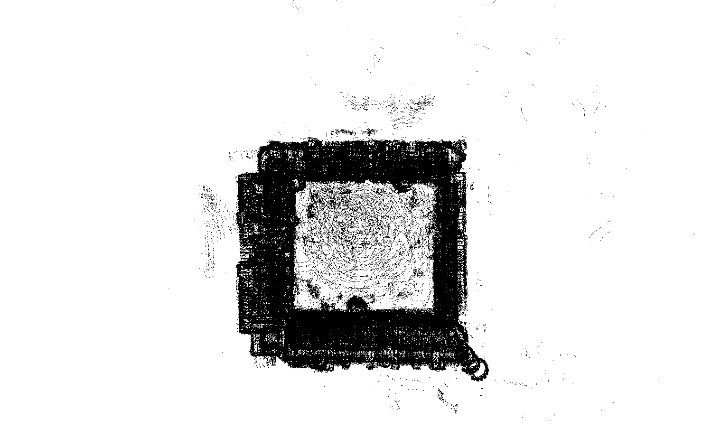
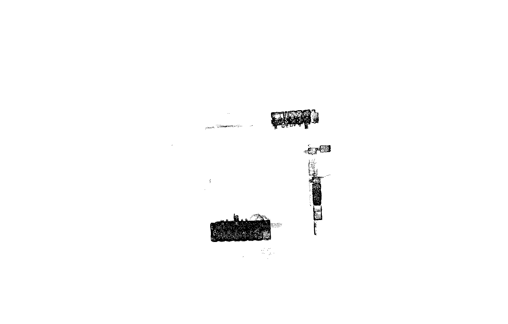
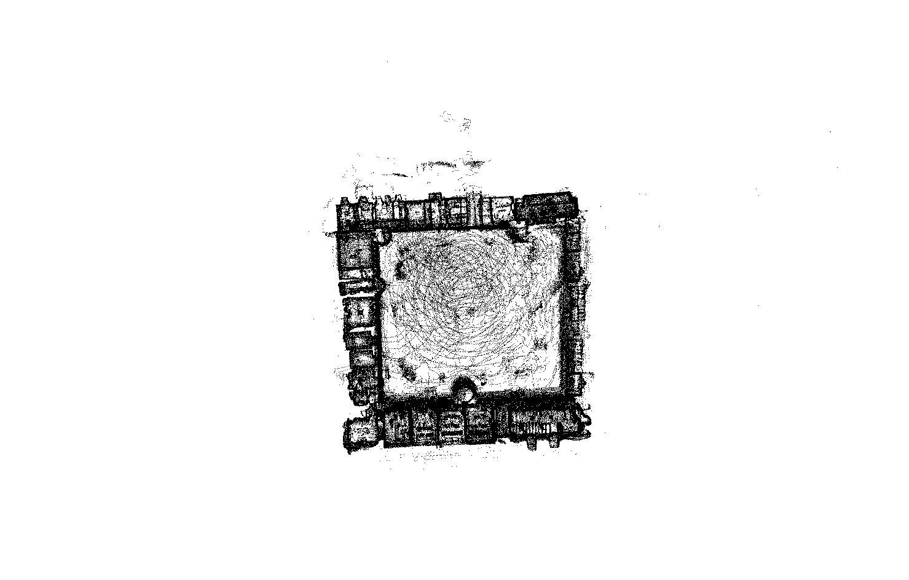
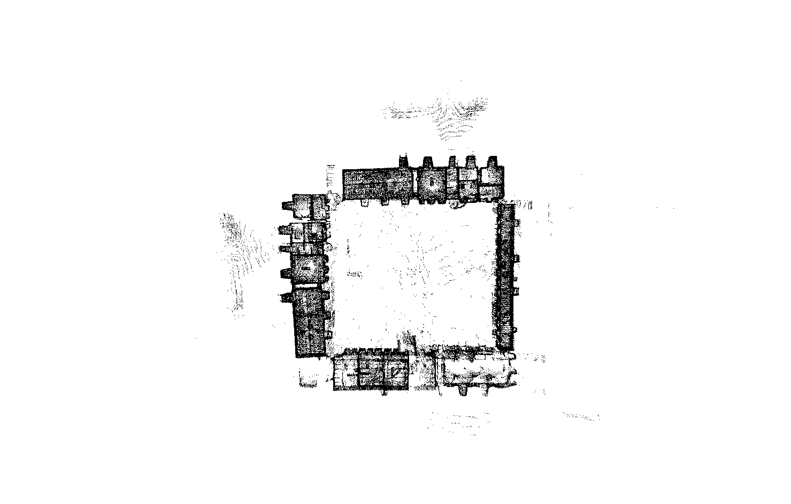
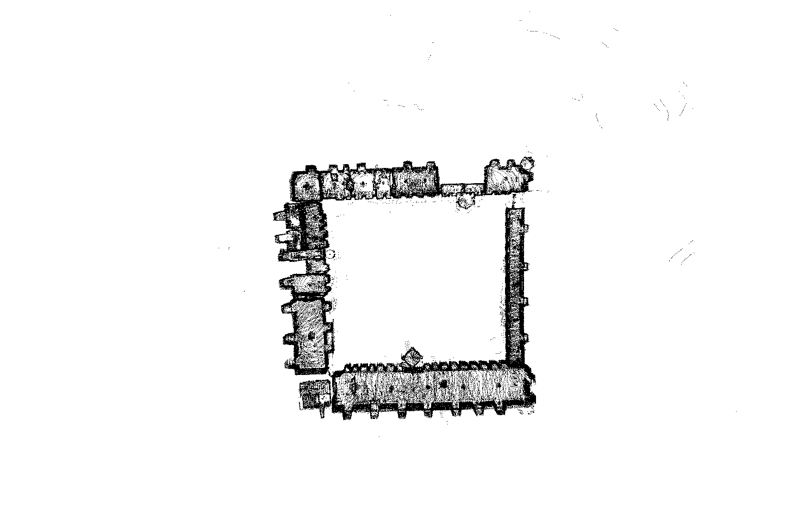
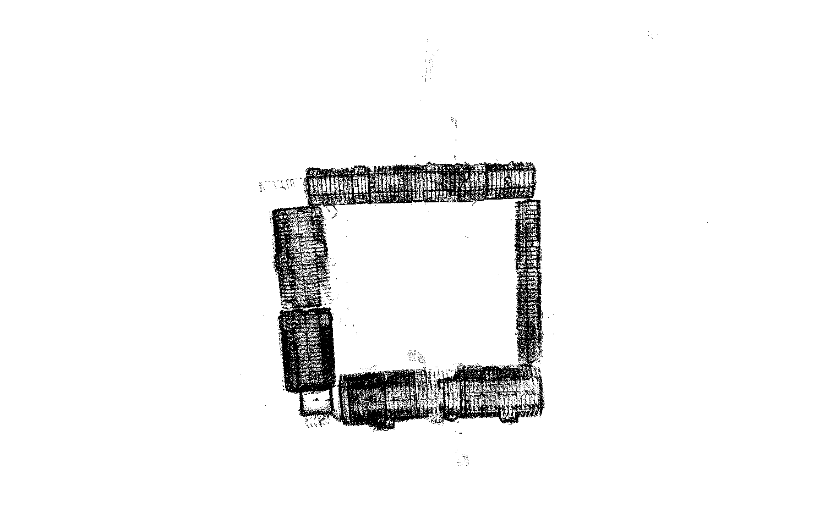
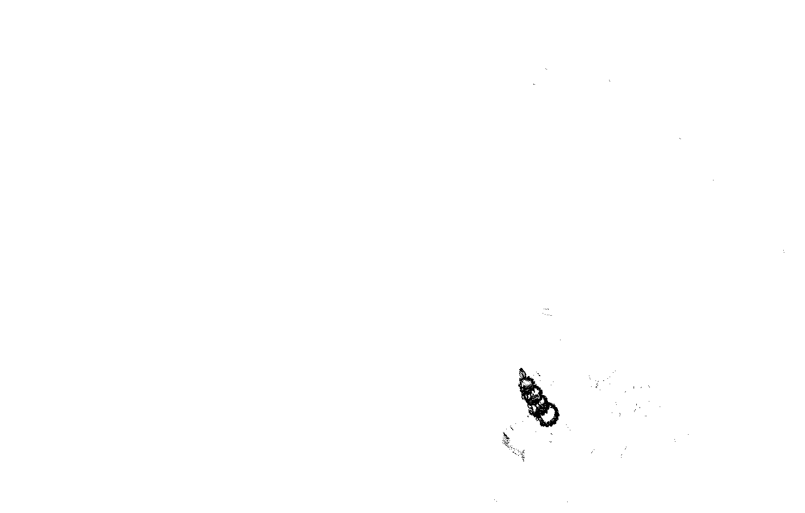

# Kronborg Castle 360-degree LiDAR Dataset

### Overview
This repository provides access to a large-scale, high-resolution LiDAR dataset collected from Kronborg Castle, a UNESCO World Heritage site located in Elsinore (Helsingør), Denmark. Famously associated with Shakespeare’s *Hamlet*, Kronborg Castle is a prime example of Renaissance architecture. The dataset offers unparalleled detail of the castle’s complex architectural features, enabling research in areas such as:

- **Simultaneous Localization and Mapping (SLAM)**
- **Floorplan generation**
- **Object recognition** and **Semantic SLAM**

### Dataset Details
The dataset was collected using a 16-channel Velodyne VLP-16 LiDAR scanner paired with an Intel RealSense L515 depth camera. It includes:

- **PointClouds** for each individual floor of the castle.
- A comprehensive **PointCloud** of the entire castle site.
- **2D occupancy grid maps** representing different sections of the castle.

We provide scans of all major accessible areas within the castle, excluding three rooms due to restricted access. The dataset is especially valuable for large-scale SLAM experiments and for exploring the alignment of PointClouds with RGB data for enhanced object recognition tasks.

### About Kronborg Castle
Kronborg Castle, established in the 15th century by King Erik VII of Denmark, holds significant historical and architectural value. Its strategic location at the narrow passage between Denmark and Sweden allowed the Danish Crown to control maritime traffic through the Baltic Sea. The castle's current structure was shaped by major renovations in the late 16th century under King Frederik II, transforming it into the iconic Renaissance fortress it is today.

---

### Dataset Contents
This dataset contains the following LiDAR scans of Kronborg Castle:

- **All Layers (Top View):** 
- **Basement:** 
- **Ground Floor:** 
- **First Floor:** 
- **Second Floor:** 
- **Third Floor:** 
- **Tower:** 

### Download Dataset
To download the full dataset, click the link below. Please note that the dataset is password-protected:

- [**Download the Dataset**](https://lunet-my.sharepoint.com/:f:/g/personal/cold2_lunet_lboro_ac_uk/EiDOfG2MsUZFi85UJqJXLdoB6tmRigyN9xK5d_mZ0-gVLg?e=OzYdZh)  
  **Password:** 2XaSDC8dYf9ibIv

---

### License
This dataset is shared under the terms of the applicable license. Please review the LICENSE file for more details.

### Citation
If you use this dataset in your work, please cite the following:

```
@article{davies2024royal,
  title={Royal Reveals: LiDAR Mapping of Kronborg Castle, Echoes of Hamlet's Halls},
  author={Davies, Leon Masterman and Sølvsten, Simon},
  journal={Arxiv},
  year={2024},
  month={September}
}
```

